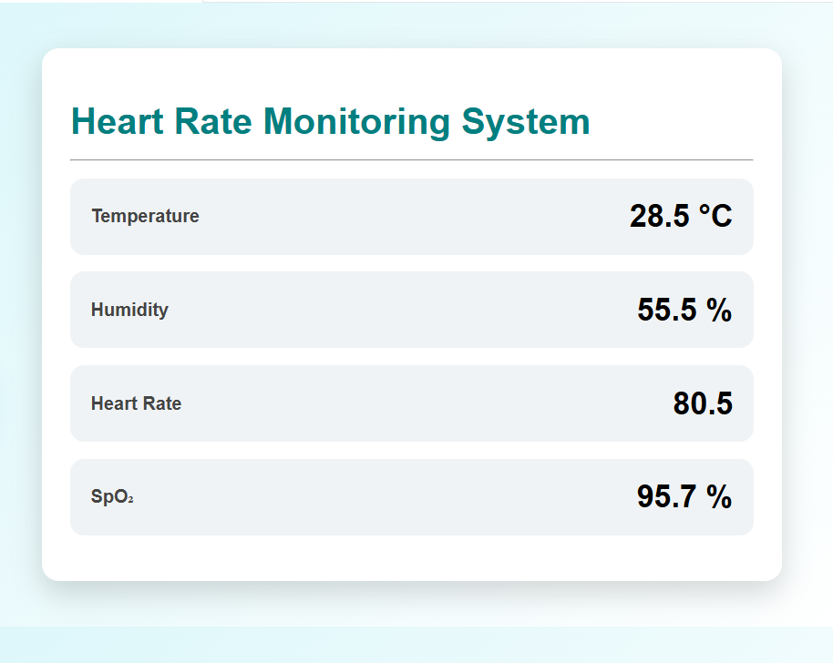
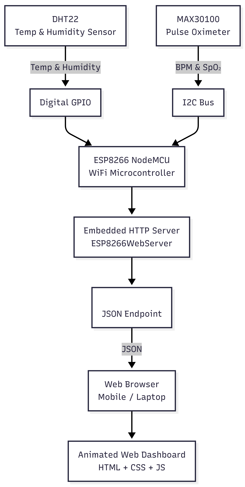

# Patient Health Monitoring System using ESP8266

A WiFi-enabled patient health monitoring system that measures:
- Heart Rate (BPM)
- Blood Oxygen Saturation (SpO₂)
- Temperature
- Humidity

Data is displayed in real time through a web dashboard hosted on ESP8266.

---

## Hardware Components
- ESP8266 NodeMCU
- MAX30100 Pulse Oximeter Sensor
- DHT22 Temperature & Humidity Sensor
- Breadboard
- Jumper Wires
- Micro USB Cable

---

## Software Requirements
- Arduino IDE
- ESP8266 Board Package
- Libraries:
  - ESP8266WiFi
  - ESP8266WebServer
  - MAX30100_PulseOximeter
  - DHT Sensor Library
  - Adafruit Unified Sensor

---

## Pin Connections

### MAX30100
| Sensor Pin | ESP8266 |
|----------|---------|
| VIN | 3.3V |
| GND | GND |
| SDA | D2 |
| SCL | D1 |

### DHT22
| Sensor Pin | ESP8266 |
|-----------|---------|
| VCC | 3.3V |
| DATA | D5 |
| GND | GND |

---

## Web Dashboard
The ESP8266 hosts a web server displaying real-time sensor values.

---

## Project Images

---

## Disclaimer
This project is for educational purposes only and is not intended for medical diagnosis.
